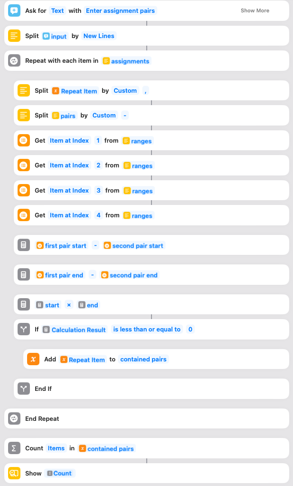
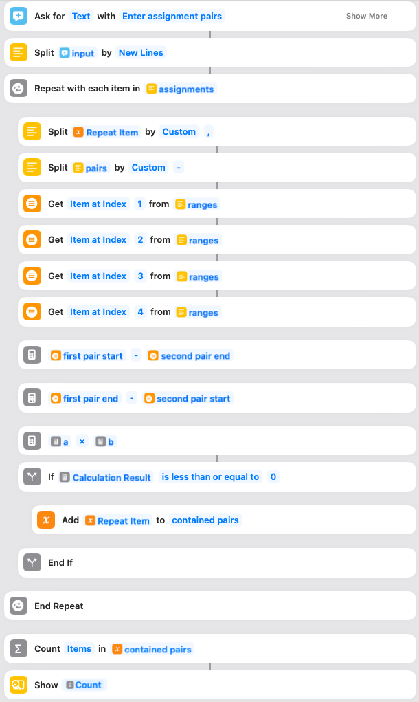

# Day 4 - Siri Shortcuts

Unfortunately, I couldn't get a satisfactory text representation of the shortcut, as it uses actions that Jellycuts can't immediately translate and I've never used it before. Instead, I've embedded the screenshots from the shortcuts editor below. The code is simple enough that the referenced magic variables should be fairly evident.

### Part 1

### Part 2
